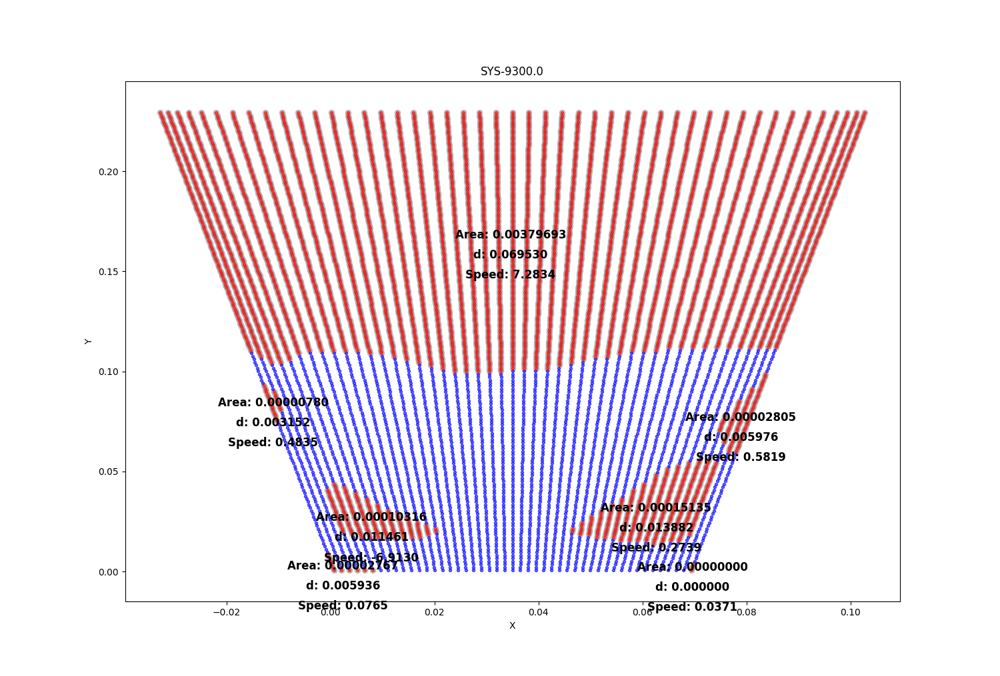
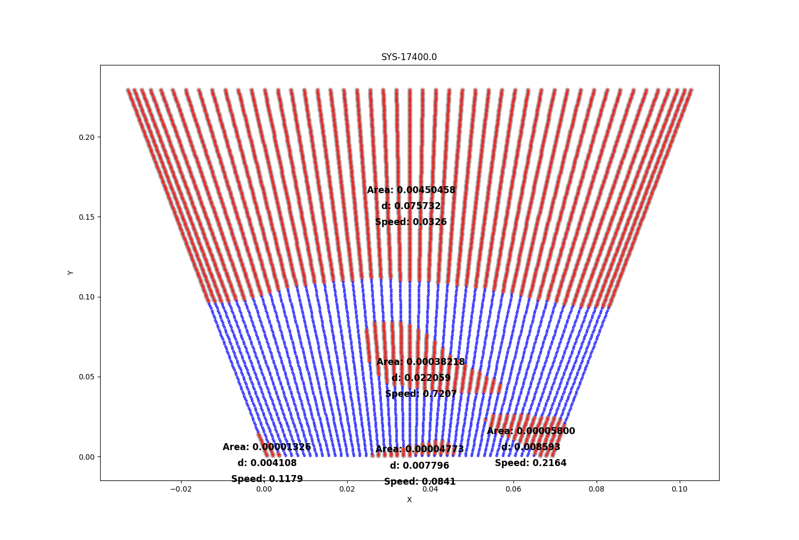
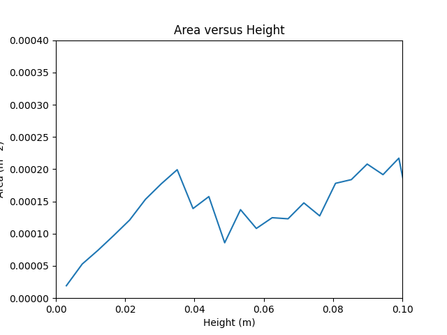
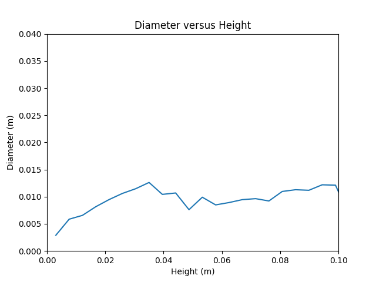
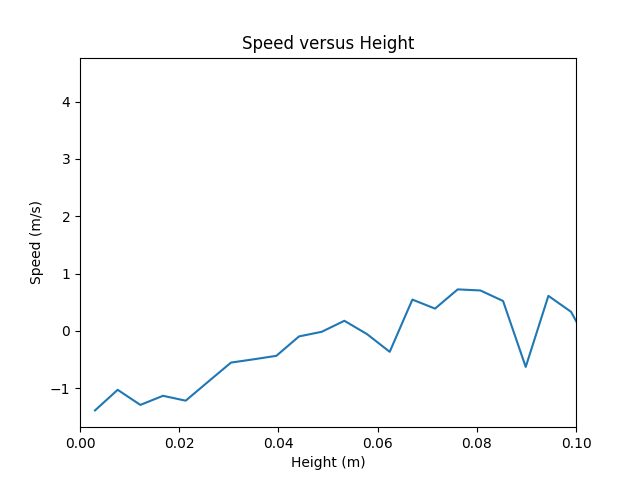

# Experiment-and-Computational-Fluid-Dynamics-Simulation
This repository contains the code and data for simulating and analyzing the hydrodynamics of gas bubbles in tapered fluidized beds using CFD and image processing methods. The code is written in Python and uses the two-fluid model with the kinetic theory of granular flow as the closure equation. The image processing methods are based on digital image analysis techniques to measure the gas bubble diameter and rising velocity from experimental images. The code and data are based on the article by [Arabi et al.](https://pubs.acs.org/doi/10.1021/acs.iecr.2c04183?ref=pdf), which explores the effects of various operating and design parameters on the gas bubble behavior in tapered fluidized beds. The simulation results are compared with the experimental data and show good accuracy.

---

## Some Results

  
  

---

## Video of Simulation

---

### Area vs Height

  

### Diameter vs Height

  

### Speed vs Height

  

---

## Dataset

You can download the dataset that I used for this simulation from [here](https://drive.google.com/file/d/1LyuvEW3IyNcN5i4ySK2DIUBqZkvhhiwx/view?usp=sharing)

---

## [Link of Article](https://pubs.acs.org/doi/10.1021/acs.iecr.2c04183?ref=pdf)
